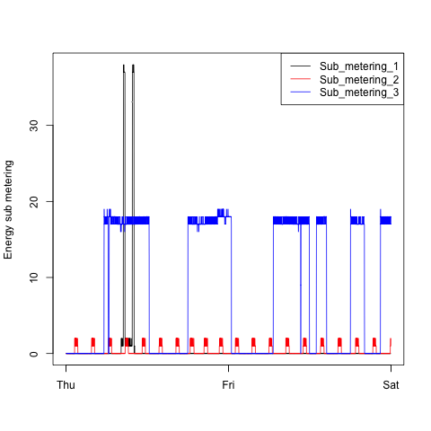

Readme
======

This repository contains the required codes and plots for the [first course project](https://class.coursera.org/exdata-002/human_grading/view/courses/972082/assessments/3/submissions) of the Coursera course **Exploratory Data Analysis**.

It has been forked from the repository of Prof. Peng which can be found [here](https://github.com/rdpeng/ExData_Plotting1).

The original README.md file has been renamed to *README2.md*.

The original data have been downloaded from [here](https://d396qusza40orc.cloudfront.net/exdata%2Fdata%2Fhousehold_power_consumption.zip), on May 5th, 2014, and result from a study on individual household power consumption described [here](https://archive.ics.uci.edu/ml/datasets/Individual+household+electric+power+consumption).

The repository contains 4 plots and the 4 R codes needed to produce them according to the requirement of the course project.

A **requirement** to use these codes is to **first unzip the original data file** downloaded from the link above (This should result in a txt file named *household_power_consumption.txt*), **then place it in your working directory**.

In each of the codes, I read only the necessary rows from the original data as described below. I then subset the resulting reduced data set accoroding to what I need to produce a given plot. This is a minor detail though.

**The background of each of the plots is set explicitely to `bg = 'transparent'`** as is the case for the illustrative figures contained in the original repository of Prof. Peng. When a transparent image is overlay on a given background, it seems to have this background color. Hence why the images seem to have a white background on the webpage of the course project.

### Structure of the original data

The original data provide measurements of electric power consumption in one household with a one-minute sampling rate (thus 1440 measurements per day) over a period of almost 4 years (Between Dec. 2006 to Nov. 2010). Different electrical quantities and some sub-metering values are available.

The file downloaded from the link above has been unzipped first, resulting in a txt file named *household_power_consumption.txt* of size 142.7 Mb, subsequently explored first on RStudio.

Loading the original unzipped data can take some time as shown below 

```
User     system      elapsed
23.634     0.423     24.062
```

The full data set has 2,075,259 rows and 9 columns separated by semicolons: 

1.     **Date**: Date in format dd/mm/yyyy
2.     **Time**: time in format hh:mm:ss
3.     **Global_active_power**: household global minute-averaged active power (in kilowatt)
4.     **Global_reactive_power**: household global minute-averaged reactive power (in kilowatt)
5.     **Voltage**: minute-averaged voltage (in volt)
6.     **Global_intensity**: household global minute-averaged current intensity (in ampere)
7.     **Sub_metering_1**: energy sub-metering No. 1 (in watt-hour of active energy). It corresponds to the kitchen, containing mainly a dishwasher, an oven and a microwave (hot plates are not electric but gas powered).
8.     **Sub_metering_2**: energy sub-metering No. 2 (in watt-hour of active energy). It corresponds to the laundry room, containing a washing-machine, a tumble-drier, a refrigerator and a light.
9.     **Sub_metering_3**: energy sub-metering No. 3 (in watt-hour of active energy). It corresponds to an electric water-heater and an air-conditioner.


### Reading the original data

As we will only be using data from dates `1/2/2007` and `2/2/2007`, and to avoid the relatively long time and big memory required to read the full data,  I imported them only once in RStudio and explored what are the rows that I need to reproduce the required plots. Thus, in all the R codes included in this repository, **I read the data file using `read.csv` with appropriate `skip` and `nrow` arguments.** 

An initial inspection of the full data on RStudio shows that they are already clean and ordered by Date and Time. All I had to do then is to find the index of the first occurence of the date `1/2/2007` and the last occurence of the date `2/2/2007`. The former is `66637` and the latter is `69516` resulting in 2880 rows of interest as expected for a 2-day period (2x1440). 

Thus, in the R codes provided, I read the original data with the arguments `skip = 66636` and `nrow = 2880`. This results in a much lower reading time as shown below

```
User     system      elapsed
0.543     0.005       0.548
```

It is the structure of the full data which allowed me to do this simple analysis of how to read the relevent rows needed for the course project in a reasonable time. The approach is not the most elegant one but it is sufficient to reproduce what is required. My way would be problematic if the original data set is changed for a reason or another.

Different solutions, some with a relative gain of time, have been proposed in the forum [here](https://class.coursera.org/exdata-002/forum/thread?thread_id=19). 

Once the reduced data set is read, the Date and Time columns are merged into a single column named `datetime` in `POSIXlt` format using the function `strptime()`. Finally, I subset the reduced data set to the needs of each plot and bind it column-wise with `datetime`. E.g.: in plot 2, I only need the data on the time evolution of the Global Active Power, so I re-asign the original data.frame `data` to include only the datetime column and the column `data$Global_active_power = data[,3]`.

### Final plots





